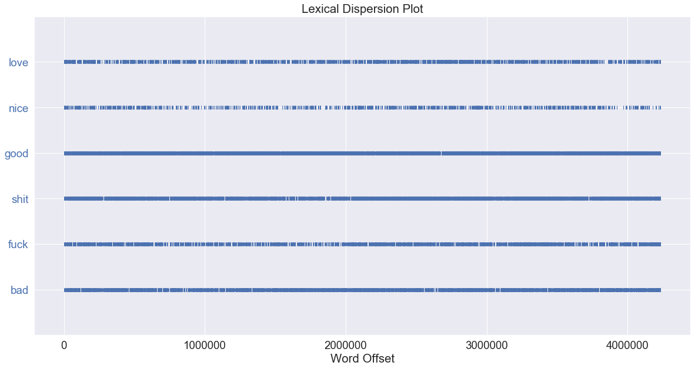
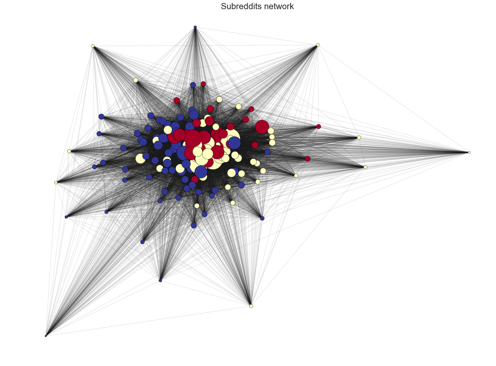
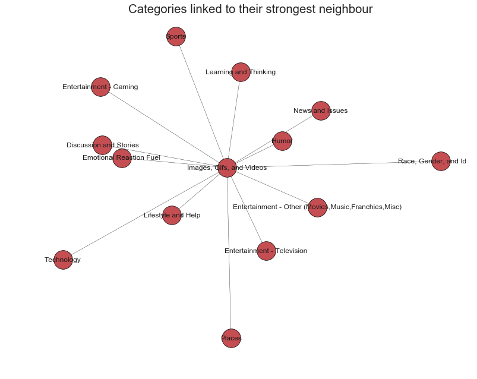

	
	<h1>Network Analysis</h1>
	<h3> A "Social Graphs and Interactions" project</h3>

# Introduction
Some sort of introduction

* What is reddit
* How does it work
* Why is it interesting
* Explain categories

# The comments

Let's start by looking at the comments and more particularly what they consist of. Below you can see the most used words in each category.

	

* React to clouds

* What is sentiment in texts
* Something about why it is interesting to do in this analysis

	

* React to highest and lowest scoring category

* Segway to why it is interesting to do lexical dispersion of those two category
* What is lexical dispersion

	<h3>News and Issues</h3>
	

	<h3>Lifestyle and Help</h3>
	

* React on the two plots

* Segway to network analysis on the subreddits and categories.

# Subreddits and Categories Network

* Networks: why are they interesting
* Subreddit network: Used Louvain to detect clusters of similar reddits, ForceAtlas to draw them in clustered
* Node size is based on how many users two nodes have in common with its neighbors
* Note that the biggest nodes are clustered together in the midelle

	

* Did the exact same thing as above, but with the categories
* Unsurprisingly they are still clustered after size.

	

* Erased all edges but the strongest one to show which category the other categories share the most users with. All link to 'Images, Gifs and Videos'
* Most likely because 'Images, Gifs and Videos' has the most subreddits.
* Reference bar graph below, which shows the number of reddits in each category.

	

	

* Finally; a confusion matrix which shows the percentage of shared users between each category
* Notice that 'Sports'/'Race, Gender and Identity' is lowest
* 'Humor'/'Images, Gifs and Videos' is the highest.

	

