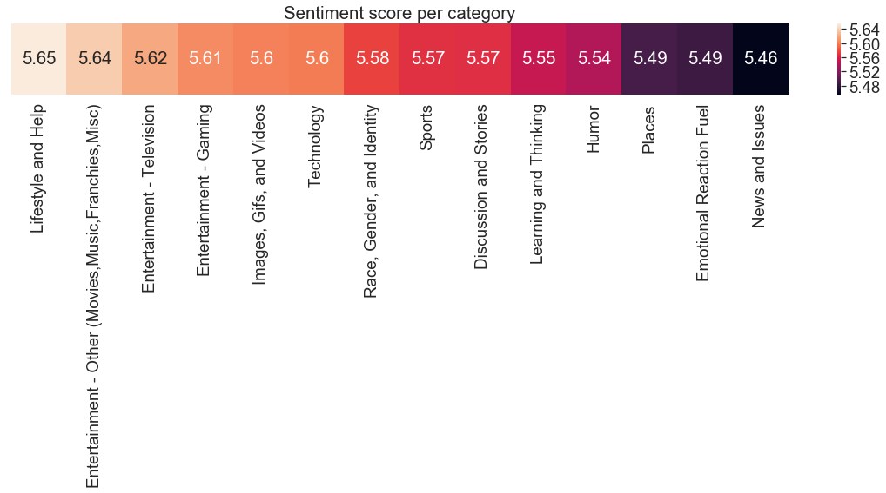
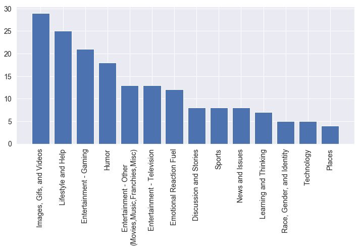

	
	<h1>Network Analysis</h1>
	<h3> A "Social Graphs and Interactions" project</h3>

# Introduction
Reddit is a large famous forum. Most of the users comes from around the world, but the main part comes from the USA. Since reddit is a forum, it is divided into subforums named subreddits. Each subreddit has a name, that reflects the theme of the content to be posted, for example /r/pokemon, is a subreddit for users that want to discuss pokemons, their names, funny stuff about how they look or maybe even ideas of how the new pokemon game is gonna be like. On each subreddit users may post various content, and users of the subreddit can write comments to the posts. If a post is popular, and reaching a certain amount of comments/upvotes per hour, the post will feature on the hot page.

The interesting part about reddit is, that it is a large forum with many different types of people, from rich to poor, tall to small and many other factors. All these people are put together on a global scale and is able to communicate about anything they desire. The behaviour of people on the forum can be interesting to see, and the contents of what people discuss, can be reflected on society.

Each of the categories is from a subreddit called "TheoryOfReddit". Here people discuss data about reddit, and the categories are originating from a dicussion of a topic on reddit. <a href="https://www.reddit.com/r/TheoryOfReddit/comments/1f7hqc/the_200_most_active_subreddits_categorized_by/">The discussion can be seen be seen here</a>

The data is fetched from reddit in the start of November 2018. <a href="https://drive.google.com/open?id=1uvFVS-QrKgAvG0nZnEKb190qXhydq9av">The data can be found here.</a>

The data has been worked with using Python.  <a href="https://nbviewer.jupyter.org/github/Jesperstriker/Jesperstriker.github.io/blob/master/Final_edit.ipynb">The notebook can be found here.</a> 

# The comments

Let's start by looking at the comments and more particularly what they consist of. Below you can see the most used words in each category.

	

It is always interesting to look at what is being discussed in each of the categories. But there are some interesting ones that stand out! For example news and issues. Trump is being mentioned alot! He is also one of the most discussed presidents of the USA, especially because there are so many divided thought of him. But the highest probability of why Trump was mentioned alot in the news section, was because of the election for the house of representatives. People also call him the "Meme president" on various sites, since he is known to draw much attention to himself using twitter.

It is interesting that Apple, Iphone and especially apps are mentioned many times in the subreddits categorized by technology. The reason why, is simply because phones are a major part of the everyday life of anyone. I bet you can recognize yourself looking at your phone many times a day!

The word clouds clearly reflects the name of the categories, and has many more interesting results!

A sentiment analysis is a way to categorize attitude of a writer towards a topic. Whether it is positive, negative or neutral. In this specific case the sentiment analyses the commenters on the subreddit, and their general attitudes in the posts in each of the categories. 

It is interesting to see the attitude of the commenters on Reddit, especially to get a general attitude of how people are towards one another.

	

The resulting sentiment analysis is very close to eachother, meaning that there are not really a big difference in peoples general attitude on the subreddits. But what is noticable is that when looking at the word clouds, one can notice that people are using the words fuck and shit on the "News and Issues" category. Comparing this to the "nice" and "love which is found in "Lifestyle and Help", we can clearly see a major difference in how people talk to one another. 

People on social media are more likely to be offensive to eachother in the cases that divides people, such as especially politics and news.

Because of this major difference, it could be interesting to look at a lexical dispersion plot of those two categories.
A lexical dispersion plot is a plot where each stribe represents an occurence of a word, and each row represents all of the comments. We can use this to see how much some words are being mentioned in each category.

	<h3>News and Issues</h3>
	

	<h3>Lifestyle and Help</h3>
	

When you look at each of these plots, we clearly see that in news and issues, the word love is being used with quite big intervals in comparison to how much it is used in lifestyle and help! Whereas fuck, shit and bad is used way more! 

The lexical dispersion plot might show a bit of how users behave on the internet. And yea, we all know that people can be real assholes on the internet! Especially when discussing. This is however proof, which of course has to be taken in consideration, that people do treat eachother poorly on the internet.

The comments are interesting, but we can also look at the user statistics of reddit, and especially the common subreddits. For example if i am a user of the subreddit gaming, am i also probably using subreddit for pokemon? 

# Subreddits and Categories Network

Networks can be interesting, because if we set it up correctly, we can gain information of how much users are mixed on each subreddit. 

The image below is a network, and a network is a graph which have "nodes" and "edges". A node is represented as one of the coloured circles, and an edge is a line. There are many unique users on each subreddit, and they are of course allowed to post on all the subreddits that they want to. And many people post or comment to multiple subreddits. Each edge shows that there are a user which has commented on both subreddits. So for example if i as a user has posted on the subreddit /r/gaming, and have also posted on /r/pokemon. The node that represents gaming, will have an edge to the node that represents pokemon. The bigger a node is, the more edges does it have, meaning that it has more common users between multiple subreddits. 

	

It is however a bit hard to see anything on the network above, which is why the same thing has been done with categories rather than subreddits.

	

Down below can we see which categories that has the most common users. All of them are actually linking to "Images,Gifs and Videos". It is also a very big category and have the most subreddits, the subreddits in it are also the most popular in all of reddit. Which also makes perfectly good sense, that people are spending time sharing and viewing other videos, especially humoristic videos!

	

	

The reference bar graph can be seen above, which shows the number of subreddits in each category. And here you can see that the "Images, Gifs and Videos" category is the largest. 

Finally a confusion matrix has been made, to show the percentages of shared users between each of the categories. Each row and column shows a small square, and each square is coloured depending on the percentage of users that are common in both subreddits. We can see that when people use the sports category they have low likelihood of using other categories. Most likely because it is people who are very interested in sports, so they are sticking to their own discussion.

The interesting part is that also the users from Race, Gender and Identity have a low likelihood of commenting or posting on another Subreddit. 

And of course, "Humor" and "Images,Gifs and Videos" are the users are spending the most time, other than their interests. It also makes perfectly sense, that users would spend their time on a subreddit in a category that fits their interests. But humor always matches interest for all of us!

	

